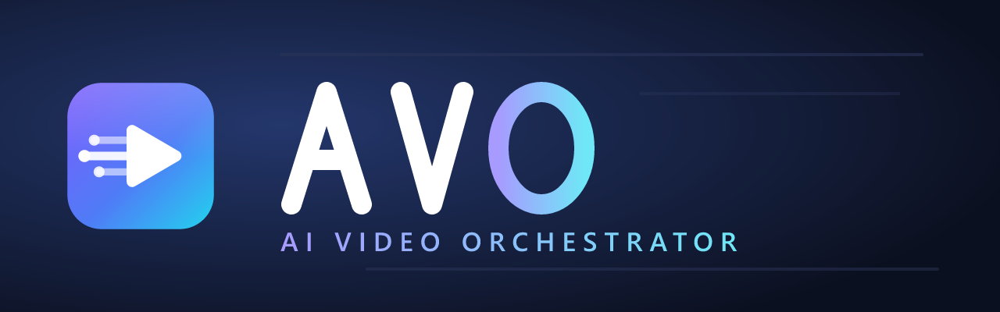

<p align="center">
  
</p>

# AVO

**Edit less. Create more.** [Quickstart now](#quickstart)

Talk to your AI agent. Drop raw footage in a folder. Get a finished, ready-to-publish
video back, **local-first**, scoped to your channel, repeatable at scale.

AVO started as a fork of [video-use](https://github.com/browser-use/video-use) and
grew into something for everyone. Today it is an **orchestrator**: it routes each
step in the pipeline to the tool that owns that job, and you drive the whole thing
through conversation, not a timeline you have to learn.

See **[Engine vs orchestrator](docs/engine-vs-orchestrator.md)** for how AVO relates to
the bundled editing engine and upstream [video-use](https://github.com/browser-use/video-use).

> AVO does **not** replace your video editor. It empowers you to do **more with
> less**: mass-producing videos per channel while the repetitive pipeline work
> runs through your agent.

---

## What you get

- **Create more, edit less.** Plan, transcribe, cut, caption, animate, and deliver
  by talking to your agent, not by clicking through every stage yourself.
- **Local first.** Transcription and most of the pipeline run on your machine. No
  account required for the core path. Usage stats (`/avo.stats`) and telemetry stay
  on disk — see [Privacy — stats & telemetry](#privacy--stats--telemetry) (end of this page).
- **Proves ideas cheaply.** Low-resolution previews first; full-quality render only
  when the cut is confident, saving time and disk.
- **Checks its own work.** After each render, AVO watches the result, fixes problems,
  and verifies again until it holds up.
- **You approve each stage.** After watch-skill and transcription analysis finish,
  AVO pauses until you review files in `edit/preview/` and `edit/review/` and say
  approve; nothing promotes on autopilot.
- **Learns your channel.** Set up a **provider** (your channel or brand) once; each
  new video for that provider starts smarter.
- **Cleans up after itself.** When the master is approved, scratch files go away.
  You keep the raw file, transcripts, and final master; nothing else.

---

## How it works

<p align="center">
  
</p>

Each video is its own project. You point AVO at a folder of raw footage and tell
your agent which **provider** (channel or brand) it belongs to. All work happens
inside that folder; your originals are never touched.

> **Approval gates.** After watch-skill finishes its review and the agent completes
> transcription analysis for that stage, AVO **stops** and waits for you. Open the
> proof in `edit/preview/` and the review package in `edit/review/`, then explicitly
> approve before the pipeline promotes resolution or moves on.

1. **Plan first ([GitHub Spec Kit](https://github.com/github/spec-kit)).**
   `/speckit.specify`, `/speckit.plan`, `/speckit.tasks` in the footage folder: spec before heavy rendering.
2. **Prove cheaply.** Quick low-res previews (~360p for edit, ~720p for motion) while
   the cut is still being figured out.
3. **Watch and fix.** watch-skill inspects each proof; the agent fixes issues and
   re-checks using the updated transcript.
4. **You approve.** Review `edit/preview/` and `edit/review/`, then approve to promote,
   or ask for changes and loop again.
5. **Promote when you say so.** Full-quality output (up to 1080p, matched to your
   source) only after your sign-off at each gate.
6. **Finish clean.** Approve the master, keep what matters, delete the rest.

Everything AVO learns is filed under your provider, so the next video for the same
channel starts smarter, while each project stays separate.

> **Resolution note.** AVO matches final output to your source. Producing above
> source resolution is **not yet supported**; see the [backlog](#backlog) and consider
> [sponsoring](#sponsor) to help us get there.

---

## Use cases

After [Quickstart](#quickstart), install **AVO skills** for your agent
(`bash install.sh` or [`docs/agent-skills.md`](docs/agent-skills.md)). Open your
**footage folder** in the agent (or paste its path). Tell it your **provider**
(channel/brand) and **where the clips live** — plain English is fine; the agent
maps that to `rawDir` internally. Then use a **slash command** (Cursor) or ask in
natural language (Claude Code, Codex, …).

| Skill | Purpose |
| ----- | ------- |
| `avo` | Session rules, hard constraints, workflow entry |
| `avo-pipeline` | Transcribe, cut, sound, motion, watch, deliver |
| `avo-provider` | Create/configure channel brand + manifest |

**Cursor:** `/avo.pipeline`, `/avo.trim`, `/avo.motion`, … — full list in [`docs/avo-commands.md`](docs/avo-commands.md).  
**Other agents:** `Load avo-pipeline` + the same provider and folder lines (see [skill map](docs/agent-skills.md#use-cases-without-slash-commands)).

### Where is your footage?

You **do not** need the word `rawDir`. Say where the files are; the agent uses
that folder as the project root (outputs land in `edit/` inside it).

| Situation | Example |
| --------- | ------- |
| You opened the folder in the agent | *The footage is in **this folder**.* |
| Windows path | *The footage is at **C:/Videos/product-review**.* |
| Mac / Linux path | *The footage is at **/Users/me/Movies/product-review**.* |
| One video inside a library | *Clips for this job are in **D:/footage/auto-lot/take-3**.* |

**Provider** = your channel or brand (e.g. `my-channel`, `pet-care-promo`). Set it
up once with [`/avo.provider`](docs/avo-commands.md) or skill `avo-provider`.

**Edit vs overlay:** AVO **cuts** filler, silences, and retakes (video-use). **Captions**
and **graphic cards** are composited on top; the clip plays underneath
(`embedded-captions`, `talking-head-recut`). Liquid-glass spec cards: edit and approve
first, then overlay, or run HyperFrames directly on a clean MP4.

### Pick your starting point

| I want to… | Start here |
| ---------- | ---------- |
| Tight product review with spec cards | [Product review](#product-review-cut-filler-add-glass-spec-cards-and-tech-subtitles) |
| Local business promo with logo + CTA | [Pet-sitting promo](#pet-sitting-promo-friendly-captions-logo-price-card-at-the-end) |
| Dealer walkthrough with per-car lower-thirds | [Car dealer](#three-cars-in-one-take-fix-mistakes-lower-thirds-facebook-captions) |
| Game review with verdict card | [Game review](#package-my-game-review-cut-the-ums-glitchy-captions-when-im-hyped-scoreboard-card-for-the-verdict) |
| Tech / gadget first impression | [Tech first look](#first-impression-on-this-gadget-tight-cold-open-terminal-captions-on-specs-one-glass-verdict-card) |
| Live pipeline demo + deep motion direction | [Pipeline demo motion](#live-pipeline-demo-four-beat-liquid-glass-cards-synced-to-the-second) |
| Health / education comparison | [Physio demo](#i-demo-two-back-exercises-clean-both-takes-label-exercise-a-and-b-calm-documentary-captions-dont-hype) |
| English master → other languages (coming soon) | [Going global](#going-global-coming-soon) |

### Subtitle styles (pick an identity)

| You want | Tell your agent |
| -------- | --------------- |
| Clean YouTube subtitles | `anchor` |
| Keynote / product launch | `keynote` |
| Gaming / cyber | `nightcity` |
| Documentary / interview | `documentary` |
| Spec readout / terminal | `terminal` |
| Stadium / verdict | `scoreboard` |

Full catalog: embedded-captions skill (`CATALOG.md`, 36 identities).

---

#### "Product review: cut filler, add glass spec cards and tech subtitles."

**You get:** A tight review with timed feature callouts and readable captions, YouTube-ready after you approve each gate.

**Skills:** `avo` + `avo-pipeline`

**Cursor:**

```text
/avo.pipeline
Provider: my-channel
The footage is at C:/Videos/product-review
```

*(If you already opened that folder in Cursor, you can say **this folder** instead of the path.)*

**Say to your agent** (any agent):

```text
Load avo-pipeline. Full pipeline.
Provider: my-channel.
The footage is at C:/Videos/product-review
Cut filler, silences, retakes. Preserve my meaning.
After I approve edit/preview: HyperFrames talking-head-recut
(glass overlay cards on specs/prices) + embedded-captions `keynote` or `anchor`.
Motion: HyperFrames by default. Remotion only if I ask or per docs/remotion-decision-guide.md.
```

**AVO runs:** transcribe → edit → watch-skill LOOP → **you approve** → motion → deliver.

---

#### "Pet-sitting promo: friendly captions, logo, price card at the end."

**You get:** A 30–60s local-business promo with brand overlays and a booking CTA.

**Skills:** `avo-provider` (first time) + `avo` + `avo-pipeline`

**Cursor:** `/avo.provider create my-pet-care` then `/avo.pipeline` with `Provider: my-pet-care`

**Say to your agent:**

```text
Provider: my-pet-care.
The footage is in this folder.
Cut dead air; keep a warm, trustworthy tone.
Captions: embedded-captions `anchor`. Overlays: talking-head-recut,
lower-thirds for service areas, glass CTA card in the last 5s.
Logo from providers/my-pet-care/logo.
```

**AVO runs:** edit → watch-skill → approve → motion → master.

---

#### "Three cars in one take: fix mistakes, lower-thirds, Facebook captions."

**You get:** A dealer walkthrough with clean beats per car and mobile-readable subtitles.

**Skills:** `avo` + `avo-pipeline`

**Cursor:** `/avo.trim` then `/avo.motion` (or `/avo.pipeline` for end-to-end)

**Say to your agent:**

```text
Provider: auto-lot.
The footage is at D:/Dealer/walkthrough-march
Edit: remove retakes between cars; don't merge separate vehicles into one claim.
Overlays: lower-third per car (year, mileage, price). Captions: `anchor`.
Use 9:16 safe margins if this is for Shorts.
```

**AVO runs:** edit → watch-skill → approve → motion → master.

---

### Going global (coming soon)

**Not implemented yet.** See [BL-004: Locale export pack](specs/backlog/locale-export.md).

#### "Approve my English master, then ship PT-BR captions and SRT sidecar."

**You get:** Same picture; Brazilian Portuguese burned captions and sidecar file after per-locale approval (dubbed audio is a later phase).

**Skills:** `avo` + `avo-pipeline`

**Cursor:** `/avo.pipeline` (after master gate)

**Say to your agent:**

```text
Provider: my-channel.
The footage is at /Users/me/Movies/english-master
After I approve the English master: backlog translate job for pt-BR.
Re-render embedded-captions with translated transcript; export SRT.
Human approve pt-BR proof before deliver/ folder promotion.
```

**AVO runs (when shipped):** master approved → translate → caption re-render → watch-skill → **you approve per locale** → deliver manifest.

---

#### "Package my game review. Cut the ums, glitchy captions when I'm hyped, scoreboard card for the verdict."

**You get:** An energetic review with genre-appropriate subtitles and a synced verdict graphic.

**Skills:** `avo` + `avo-pipeline`

**Cursor:**

```text
/avo.pipeline
Provider: my-gaming-channel
The footage is at C:/Videos/game-review/elden-ring
Footage: raw/review-take.mp4
```

**Say to your agent:**

```text
Load avo-pipeline. Full pipeline.
Provider: my-gaming-channel.
The footage is at C:/Videos/game-review/elden-ring
Edit: filler, silence, failed takes. Captions: `nightcity` or `scoreboard` on the verdict.
Overlays: talking-head-recut for score/chapter cards. HyperFrames only.
```

**AVO runs:** edit → watch-skill → approve → motion → deliver.

**Motion:** HyperFrames: `embedded-captions` + `talking-head-recut`. Remotion only if
you generate dozens of templated variants from structured scores; see
[`docs/remotion-decision-guide.md`](docs/remotion-decision-guide.md).

---

#### "First impression on this gadget. Tight cold open, terminal captions on specs, one glass verdict card."

**You get:** A fast first-look with anchored spec moments and a single memorable verdict.

**Skills:** `avo` + `avo-pipeline`

**Cursor:** `/avo.pipeline` · **Guidelines:** `/avo.guidelines --youtube`

**Say to your agent:**

```text
Load avo-pipeline. Full pipeline; prove at 360p/720p until I approve.
Provider: tech-first-look.
The footage is in this folder.
Edit: trim setup ramble; keep the first genuine reaction.
Captions: `terminal` for specs, `keynote` if the scene is bright.
One talking-head-recut glass overlay at the verdict. Stay on 360p/720p until I approve.
```

**AVO runs:** edit → watch-skill → approve → motion → deliver.

**Motion:** HyperFrames: `terminal` / `keynote` captions + glass overlay layout.
Remotion only if first-impression templates already live in a React app with
SKU-specific props.

---

#### "Live pipeline demo: four beat liquid-glass cards synced to the second."

**You get:** A talking-head demo where timed overlay beats explain the AVO workflow —
karaoke title, mistakes card, pipeline story, and a HyperFrames alt palette — each
popping in on the exact spoken phrase. Full beat-level spec:
[`docs/deep-animation-direction-exemplar.md`](docs/deep-animation-direction-exemplar.md).

**Skills:** `avo` + `avo-pipeline` · **Provider:** `tech-first-look` (example)

**Cursor:**

```text
/avo.pipeline
Provider: tech-first-look
The footage is in this folder.
Follow specs/active/avo-pipeline-demo-motion/animation-direction.md
```

**Say to your agent** (deep animation direction — copy and adapt):

```text
Load avo-pipeline + talking-head-recut + motion-doctrine.
Provider: tech-first-look. The footage is in this folder.

Four beats — sync each to the spoken phrase (±100 ms):

1. OPENING — when I say "This is the example video that we're editing live together":
   left-half liquid glass card; karaoke-style word pop-in (title treatment).

2. MISTAKES — when I say "I might make a few mistakes and that's okay":
   bottom card: "Mistakes will be cut."; right-half trim/edit motion graphic.

3. PIPELINE — when I describe dropping in a raw file and getting edits + motion:
   center liquid glass card; story: raw file → transcript → cuts → motion layers → export.
   Label illustrative if simplified. Density Level 4 inside the card only.

4. HYPERFRAMES ALT — when I say "Using HyperFrames instead":
   left + right cards simultaneously; different palette (teal/violet vs warm glass);
   slide-in grammar instead of pop-in.

Build four parallel slots under edit/animations/slot_*.
Prove at 720p; run watch-skill LOOP per slot before composite.
Stop at motion-proof approval gate.
```

**Beat map (reference timestamps from exemplar transcript):**

| Beat | Trigger | In (s) | Visual |
| --- | --- | --- | --- |
| A | "…editing live together" | 0.84 | Left glass + karaoke title |
| B | "…mistakes…okay" | 9.06 | Bottom card + right trim viz |
| C | pipeline / raw file | 18.4 | Center pipeline story (5 sub-beats) |
| D | "HyperFrames instead" | 38.92 | Left + right alt-palette cards |

**AVO runs:** transcribe → edit → watch-skill → **you approve** → four parallel
motion slots → parallel 720p LOOP → composite sync QC → **you approve** → deliver.

**Motion:** HyperFrames `talking-head-recut` (beats A, B, D) + `general-video` (beat C).
See [`animation-direction.md`](specs/active/avo-pipeline-demo-motion/animation-direction.md)
for layout zones, motion tokens, and acceptance tests.

---

#### "I demo two back exercises. Clean both takes, label Exercise A and B, calm documentary captions. Don't hype."

**You get:** A comparison edit with clear labels and conservative styling, no misleading motion.

**Skills:** `avo` + `avo-pipeline`

**Cursor:** `/avo.trim` (cut-focused) or `/avo.pipeline` if you want motion lower-thirds

**Say to your agent:**

```text
Load avo-pipeline. Trim and deliver (motion optional).
Provider: physio-edu.
The footage is at /Users/me/Videos/back-exercises-demo
Edit: remove retakes; preserve exercise order and safety cues I stated.
Do not imply medical outcomes I didn't say.
Captions: `documentary` or `anchor`. Overlays: lower-thirds for Exercise A / B only.
No hype caption styles (stomp, ordnance, …).
```

**AVO runs:** edit → watch-skill → approve → deliver (motion optional).

**Motion:** HyperFrames at low density (Level 1–2). Avoid hype identities; readability
and factual restraint come first.

---

### Slash commands (Cursor)

Same goals in one line — load skill **`avo-pipeline`** (or **`avo-provider`** where noted):

| Goal | Command |
| ---- | ------- |
| List all commands | `/avo.help` or `/avo --help` |
| YouTube format rules | `/avo.guidelines --youtube` |
| Audio EQ rules | `/avo.guidelines --eq` |
| TikTok / Shorts rules | `/avo.guidelines --tiktok` or `--shorts` |
| Transcribe only | `/avo.transcribe` |
| Full folder with assets | `/avo.pipeline` |
| Cut only | `/avo.trim` |
| Fix room noise + mix | `/avo.sound` |
| Check one bad cut | `/avo.audit` + `from`/`to` |
| Ready for approval | `/avo.watch` |
| Logo spin / glass card | `/avo.motion` |
| Disk / progress report | `/avo.telemetry` |
| Local usage stats | `/avo.stats` (local disk only — [`SECURITY.md#privacy--telemetry`](SECURITY.md#privacy--telemetry)) |
| Create provider | `/avo.provider` |
| After master approved | `/avo.learndown` then `/avo.cleanup` |
| Open topic docs | `/avo.docs` |

**Other agents:** `Load avo-pipeline. Run full pipeline.` + `Provider:` + `The footage is at …`
(or *this folder*). Full command reference: [`docs/avo-commands.md`](docs/avo-commands.md).

---

### More ways to run AVO

Power-user prompts, one routing cell at a time. Full table: [Tool routing](#tool-routing-who-owns-which-job).

- **Plan in Spec Kit first:** `/speckit.specify`, `/speckit.plan`, `/speckit.tasks` with `rawDir` as the workflow root ([GitHub Spec Kit](https://github.com/github/spec-kit)).
- **Full folder → YouTube-ready:** Spec Kit (optional) → transcribe → cut → watch-skill → you approve → motion → master → cleanup.
- **Local transcribe only:** faster-whisper on your machine; language set at setup (`--lang pt`, `--lang en`, …). Active model tier is disclosed at setup and in phase telemetry — see [`docs/model-transparency.md`](docs/model-transparency.md).
- **ElevenLabs for this one video:** swap **Paid** on transcribe only; everything else stays Local.
- **Cut and caption only:** skip motion; master after edit-proof approval.
- **HyperFrames, not Remotion:** default motion path; see [`docs/remotion-decision-guide.md`](docs/remotion-decision-guide.md) for exceptions.
- **I approve every promotion:** watch-skill loops on proofs; you sign off in `edit/preview/` and `edit/review/` before 360p → 720p → 1080p ([How it works](#how-it-works)).
- **Same channel, tenth video:** one **provider**; point at a new footage folder each time. Optional [ai-memory](https://github.com/akitaonrails/ai-memory) learndown.
- **Continue in another agent:** ai-memory handoff across Claude Code, Cursor, etc.
- **Prove cheaply first:** 360p edit proof, then 720p motion; full res only after approval.
- **gemini-flow for this export:** swap **Paid** on render only.

More mechanics: [`docs/avo-workflow.md`](docs/avo-workflow.md). Setup: [`install.md`](install.md).

---

## Why not a native video-editing MCP?

Tools like CapCut MCP are built for **one app and one timeline**; your agent moves
clips inside that editor. That is great for hands-on cutting inside a single product.

AVO is built for a different job: **orchestrating the full pipeline** across the
best tool for each step.

- **Whole pipeline, not one timeline.** Plan → transcribe → cut → motion → verify →
  deliver; each stage goes to the engine that owns it.
- **Empower editors, don't replace them.** Keep Premiere, DaVinci, or CapCut for
  craft. AVO handles the repetitive glue so you ship more videos.
- **Local and composable.** Core steps run on your machine. Swap a **Local** engine
  for a **Paid** alternative at one stage without rebuilding everything.
- **Mass-produce per provider.** One channel profile, many videos; learning stays
  scoped so styles don't bleed across accounts.
- **Inspectable.** Files stay on your disk. The workflow is conversation-driven but
  reproducible, not locked in a vendor cloud project.

For the full decision record, see [`docs/why-not-editor-mcp.md`](docs/why-not-editor-mcp.md).

---

## Tool routing: who owns which job

AVO routes every stage to the tool that owns it. **Local** is the default,
runs on your machine, and needs no account. **Paid** is an optional hosted
alternative for that stage (it may be excellent; it is simply labelled by how
it's billed, nothing more).

| Job | Local | Paid |
| --- | --- | --- |
| Plan & spec | [GitHub Spec Kit](https://github.com/github/spec-kit) (`/speckit.*` commands) | |
| Edit / transcribe / caption | [video-use](https://github.com/browser-use/video-use) + [faster-whisper](https://github.com/SYSTRAN/faster-whisper) (language chosen at setup) | [ElevenLabs](https://elevenlabs.io) |
| Understand / self-verify (THE LOOP) | [watch-skill](https://github.com/oxbshw/watch-skill) (MCP/CLI/REST, local-first) | |
| Motion / animation | HyperFrames (default) → [Remotion](https://github.com/remotion-dev/remotion) | |
| Render / encode | local render helpers | gemini-flow |
| Cross-session memory | [ai-memory](https://github.com/akitaonrails/ai-memory) (optional) | |
| Agent sandbox | [ai-jail](https://github.com/akitaonrails/ai-jail) (optional, WSL-only on Windows) | |
| Logo / brand | [logo-generator-skill](https://github.com/op7418/logo-generator-skill) | |
| Post-render cleanup | rimraf + ai-memory learndown (reports space used vs freed) | |

<p align="center">
  
</p>

**Two ways to run a stage:** stay **Local** (default, on your machine) or swap in a
**Paid** alternative for that job only: ElevenLabs for transcription, gemini-flow for
render, and so on. The orchestrator stays the same; you change one cell in the routing
table, not the whole pipeline.

---

## Install

**One command. Finds every agent on your machine. Installs for each.**

```bash
# macOS · Linux · WSL · Git Bash
curl -fsSL https://raw.githubusercontent.com/joaobispo2077/avo/main/install.sh | bash
```

```powershell
# Windows · PowerShell 5.1+
irm https://raw.githubusercontent.com/joaobispo2077/avo/main/install.ps1 | iex
```

~30 seconds. Needs Node ≥18. Skips agents you do not have. Safe to re-run.

<details>
<summary><strong>Install for one agent, or any of 30+ others</strong></summary>

<br>

Every agent has its own path (plugin, extension, rule file, or `npx skills add`). The full per-agent matrix, all flags, dry-run, and uninstall live in **[install.md § Tier 1](./install.md#tier-1--fast-agent-install)**. A few common ones:

```bash
# Cursor / Windsurf / Cline / Codex / 30+ more, via the skills registry
npx skills add joaobispo2077/avo -a cursor

# From a clone (local dev)
bash install.sh --only cursor
node bin/install.cjs --dry-run
```

**Need ffmpeg + whisper + watch-skill?** Re-run with `--full` or follow [Quickstart](#quickstart) / [install.md](install.md).

**Install broke?** Open your agent in this repo and say: *"Read install.md and install AVO for me."*

</details>

---

## Supported agents

AVO installs into the agents it finds on your machine (or the one you pick with `--only`).

| ID | Agent | Tier 1 (skills + commands) | Full toolchain |
| -- | ----- | --------------------------- | -------------- |
| `cursor` | [Cursor](https://cursor.com) | 3 skills + `/avo.*` slash commands | `bash install.sh --full` |
| `claude` | Claude Code | 3 skills (`avo`, `avo-pipeline`, `avo-provider`) | `bash install.sh --full` |
| `codex` | Codex CLI | 3 skills | `bash install.sh --full` |
| `windsurf` | Windsurf | 3 skills | `bash install.sh --full` |
| `cline` | Cline | 3 skills | `bash install.sh --full` |
| `gemini` | Gemini CLI | 3 skills | `bash install.sh --full` |
| `opencode` | OpenCode | 3 skills | `bash install.sh --full` |

Skill details and non-Cursor prompts: **[docs/agent-skills.md](docs/agent-skills.md)**.

Per-agent detect paths, flags, dry-run, and uninstall: **[install.md § Tier 1](./install.md#tier-1--fast-agent-install)**. List IDs from a clone: `node bin/install.cjs --list`.

---

## Quickstart

AVO ships **native setup scripts** that prepare the whole toolchain (GitHub Spec Kit,
video-use + faster-whisper, watch-skill, HyperFrames, Remotion, and optional
extras). You'll be asked which transcription language to prepare.

**Windows / WSL (PowerShell):**

```powershell
# PowerShell 7+ (pwsh) or Windows PowerShell 5.1 both work:
pwsh scripts/setup.ps1 --lang en
# Windows PowerShell 5.1 (if you don't have pwsh):
powershell -ExecutionPolicy Bypass -File scripts/setup.ps1 --lang en
```

**macOS / Linux / WSL (bash):**

```bash
bash scripts/setup.sh --lang en
```

Common flags: `--lang <code>` (transcription language), `--with-memory`
(install [ai-memory](https://github.com/akitaonrails/ai-memory)), `--with-jail`
(install the optional [ai-jail](https://github.com/akitaonrails/ai-jail)
sandbox), `--with-logo` (install the logo pipeline), `--skip <tool>`.

Then point your agent at a folder of raw footage and start a conversation:

**Or use pipeline slash commands** (copy `commands/avo/` → `.cursor/commands/avo/`; see [`docs/avo-commands.md`](docs/avo-commands.md)). Start with `/avo.help` or `/avo --help`:

```text
/avo.pipeline
Provider: my-channel
The footage is at C:/Videos/my-first-edit
```

If you already opened that folder in the agent, say **this folder** instead of the path.

```bash
cd C:/Videos/my-first-edit
claude   # or codex, cursor, etc.
```

Tell it which **provider** the video is for and **where your clips live** (path or
“this folder”), then ask it to edit. Or run [`/avo.pipeline`](docs/avo-commands.md)
with the same lines. All generated output lives inside that footage folder; your
source files are never touched.

Full setup details and troubleshooting live in [`install.md`](install.md).

---

## Documentation

- [`docs/avo-workflow.md`](docs/avo-workflow.md): the AVO workflow, in precise,
  agent-facing detail (confidence gate, the LOOP, **human approval gates**,
  telemetry, hardware advisory, learndown + cleanup, wrap reports, `/avo.stats`,
  provider learning).
- [`SECURITY.md`](SECURITY.md#privacy--telemetry): privacy for telemetry and stats
  (no phone home; local disk only).
- [`docs/providers.md`](docs/providers.md): what an AVO **provider** is, multi-provider
  patterns (long-form vs Shorts), manifest fields, and setup workflow.
- [`docs/agent-skills.md`](docs/agent-skills.md): install **`avo`**, **`avo-pipeline`**,
  **`avo-provider`** on Cursor, Claude Code, Codex, and other supported agents.
- [`docs/why-not-editor-mcp.md`](docs/why-not-editor-mcp.md): why AVO orchestrates
  across tools instead of controlling one editor app.
- [`docs/ci.md`](docs/ci.md): CI gates, GitHub Actions workflows, local reproduce commands.
- [`docs/README.md`](docs/README.md): index of every topic doc below.
- [`docs/editing-system.md`](docs/editing-system.md): the YouTube editing
  workflow and philosophy.
- [`docs/audio-post-production-system.md`](docs/audio-post-production-system.md):
  audio intake, sync, restoration, and mix.
- [`docs/animation-system.md`](docs/animation-system.md): the animation and
  motion-design system.
- [`docs/hyperframes-workflow.md`](docs/hyperframes-workflow.md): HyperFrames,
  the default motion framework.
- [`docs/remotion-decision-guide.md`](docs/remotion-decision-guide.md): when to
  choose Remotion instead.
- [Use cases](#use-cases) — all conversation prompts (product, promo, dealer, game, tech, pipeline demo motion, health, going global, slash commands).
- [`docs/repo-layout.md`](docs/repo-layout.md): what ships in git vs install-time.
- [`docs/launch.md`](docs/launch.md): pre-push GitHub checklist.
- [`docs/delivery-specifications.md`](docs/delivery-specifications.md),
  [`docs/audio-delivery-specifications.md`](docs/audio-delivery-specifications.md),
  [`docs/animation-delivery-specifications.md`](docs/animation-delivery-specifications.md):
  delivery specs for video, audio, and animation.

The canonical rules for every agent driving AVO live in
[`AGENTS.md`](AGENTS.md).

---

## Sponsor

AVO is free and open. If it saves you time, you can help fund the roadmap,
including the [backlog](#backlog) items like upscaling and higher-than-source
output:

- **GitHub Sponsors:** [github.com/sponsors/joaobispo2077](https://github.com/sponsors/joaobispo2077)
- **Buy Me a Coffee:** [buymeacoffee.com/joaobispo2077](https://buymeacoffee.com/joaobispo2077)

---

## Backlog

Some capabilities are planned but not yet implemented. Each has a sponsor CTA if
you'd like to move it up the queue. [Full roadmap → specs/backlog/README.md](specs/backlog/README.md)

- **BL-001** [Upscaling low-quality source footage](specs/backlog/upscaling.md): controlled upscale path for phone/Zoom archives.
- **BL-002** [Higher-than-source output resolution](specs/backlog/higher-than-source-res.md): opt-in delivery above camera native resolution.
- **BL-003** [Provider voice profile from past videos](specs/backlog/voice-profile.md): sound like the creator on dubs, with consent.
- **BL-004** [Locale export pack (ES, PT-BR, JA, ZH)](specs/backlog/locale-export.md): captions-first exports from one English master.
- **BL-005** [Multi-audio delivery manifest](specs/backlog/multi-audio-deliver.md): delivery folder with per-locale tracks and manifest.

See [Sponsor](#sponsor) to fund priority items.

---

## Privacy: stats & telemetry

**No phone home.** `/avo.stats` and phase telemetry read **local files only**
(`.avo/state.json`, optional `avo.wrap.*` on your footage folders). No analytics
backend, no accounts, no usage upload. Install-time network (git, models, agent
registries) is separate — full detail in
[`SECURITY.md#privacy--telemetry`](SECURITY.md#privacy--telemetry).

---

## Built on

AVO orchestrates these tools. All credit for the engines belongs to their
authors and communities:

- [video-use](https://github.com/browser-use/video-use): the conversation-driven
  editing engine AVO grew out of.
- [faster-whisper](https://github.com/SYSTRAN/faster-whisper): local, offline
  transcription with word-level timestamps.
- [GitHub Spec Kit](https://github.com/github/spec-kit): spec-driven planning
  (`/speckit.specify`, `/speckit.plan`, `/speckit.tasks`, …).
- [watch-skill](https://github.com/oxbshw/watch-skill): local-first video
  understanding and self-verification (THE LOOP).
- HyperFrames: the default deterministic HTML motion framework.
- [Remotion](https://github.com/remotion-dev/remotion): data-driven React motion,
  when it's the better fit.
- [ai-memory](https://github.com/akitaonrails/ai-memory): optional cross-session
  memory.
- [ai-jail](https://github.com/akitaonrails/ai-jail): optional agent sandbox
  (WSL-only on Windows).
- [logo-generator-skill](https://github.com/op7418/logo-generator-skill):
  logo and brand asset generation.
- [ElevenLabs](https://elevenlabs.io) and gemini-flow: optional Paid
  alternatives for transcription and render.

---

<p align="center"><sub>AVO · Edit less. Create more. · local-first video orchestration for your agent.</sub></p>
