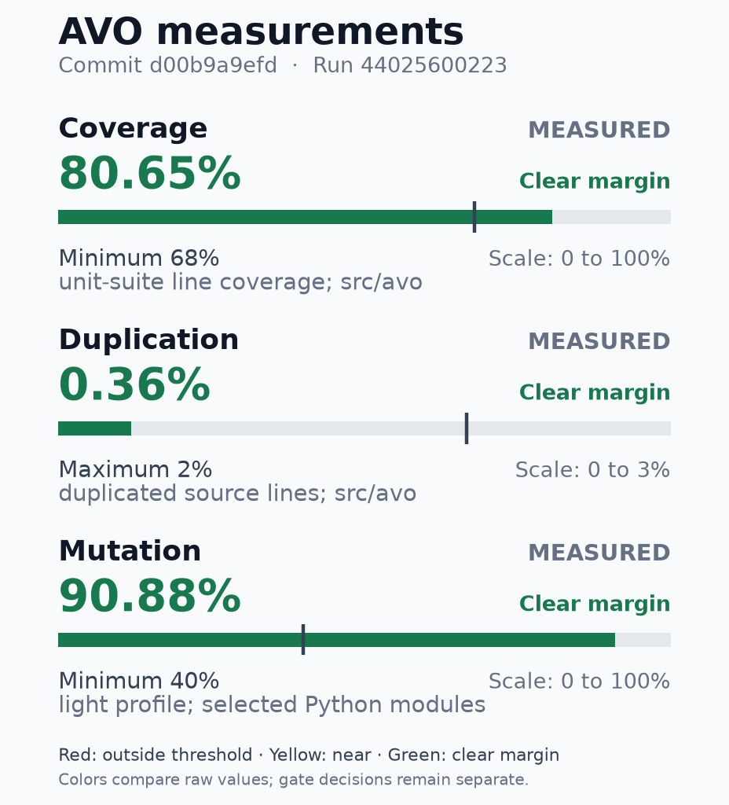

# Quality metrics

Release readout of the exact commit and CI run. Measurements and thresholds do not replace mandatory checks.

| Field | Value |
|---|---|
| Version | 1.22.0 |
| Tag | v1.22.0 |
| SHA | `d00b9a9efdb3ba27ee25848f64a6e8f9790da507` |
| Recorded (UTC) | 2026-11-17T05:59:10Z |

## AVO quality

**Overall: PASS**

Commit: `d00b9a9efdb3ba27ee25848f64a6e8f9790da507` · Run: `44025600223`

PR head: `Unavailable`
PR base: `Unavailable`
Tested revision: `d00b9a9efdb3ba27ee25848f64a6e8f9790da507`
Attempt: 1. Passed producer evidence may come from earlier attempts of the same run.

All mandatory gate decisions and required jobs passed.

**Measurements**

Evidence completeness: 9 measured, 1 partial, 1 unavailable. Gate decisions are below.

Unavailable evidence: Safety branch coverage.

| Metric | Measured | Scope | Evidence |
|---|---|---|---|
| Line coverage | 80.65% | unit suite; src/avo | 39,077/48,450 executable lines [coverage.json](https://github.com/joaobispo2077/avo/actions/runs/44025600223/artifacts/14303183362) (SHA-256 `e20e0cb4dba2`) |
| Duplication | 0.36% | source lines; src/avo | 377/105,752 duplicated lines; 40 clone pairs [jscpd/jscpd-report.json](https://github.com/joaobispo2077/avo/actions/runs/44025600223/artifacts/14303183362) (SHA-256 `2e236a9ffb31`) |
| Mutation efficacy | 90.88% | light profile; selected Python modules | 488 killed / 49 survived / 537 total; 0 unresolved [mutation-metrics.json](https://github.com/joaobispo2077/avo/actions/runs/44025600223/artifacts/14303168665) (SHA-256 `b691fc86938b`) |

### Mutation efficacy by source

PARTIAL: Scope counters reconcile; some efficacy measurements are unavailable.
Existing mutation enforcement applies to the aggregate profile. Source colors and the aggregate floor line are informational comparisons.

Aggregate: 488 killed / 49 survived / 537 total; 0 unresolved. Complete execution: True.

Source excerpt: 5/5. Missing/incomplete first, then lowest measured efficacy; M IDs sort by full source path.

| Source ID and full path | Efficacy / state | Actual outcome counts |
|---|---|---|
| M005: [src/avo/validate_usability.py](https://github.com/joaobispo2077/avo/blob/d00b9a9efdb3ba27ee25848f64a6e8f9790da507/src/avo/validate_usability.py) | Zero mutants; efficacy unavailable. | 0 killed / 0 survived / 0 total; 0 unresolved |
| M002: [src/avo/mcp/bridge.py](https://github.com/joaobispo2077/avo/blob/d00b9a9efdb3ba27ee25848f64a6e8f9790da507/src/avo/mcp/bridge.py) | 73.39% | 80 killed / 29 survived / 109 total; 0 unresolved |
| M004: [src/avo/validate_dependencies.py](https://github.com/joaobispo2077/avo/blob/d00b9a9efdb3ba27ee25848f64a6e8f9790da507/src/avo/validate_dependencies.py) | 95.23% | 379 killed / 19 survived / 398 total; 0 unresolved |
| M003: [src/avo/mcp/registry.py](https://github.com/joaobispo2077/avo/blob/d00b9a9efdb3ba27ee25848f64a6e8f9790da507/src/avo/mcp/registry.py) | 95.65% | 22 killed / 1 survived / 23 total; 0 unresolved |
| M001: [src/avo/adapters/registry.py](https://github.com/joaobispo2077/avo/blob/d00b9a9efdb3ba27ee25848f64a6e8f9790da507/src/avo/adapters/registry.py) | 100.00% | 7 killed / 0 survived / 7 total; 0 unresolved |

[Complete mutation source index and outcome proof (text archive)](kpi-detail:mutation-efficacy.md)

### Complexity and CRAP review

4614 observed functions; 4560 measured CRAP; 54 observed functions unmeasured; 0 source-analysis errors. Total population known.
CRAP reference 30 is informational. Existing complexity policy and exceptions remain separate.

**Cyclomatic complexity: 10/4614 eligible candidates shown**. highest observed values, capped at 10; ties: descending value, then canonical path, definition line, qualified name.

| ID | Full source identity | Observed value | Unit |
|---|---|---:|---|
| U0011 | [src/avo/adapters/media/audio_tracks.py:61 compile_continuous_audio_graph](https://github.com/joaobispo2077/avo/blob/d00b9a9efdb3ba27ee25848f64a6e8f9790da507/src/avo/adapters/media/audio_tracks.py#L61) | 51 | independent paths |
| U4511 | [src/avo/validate_edl.py:119 _bluray_ps5_semantic_errors](https://github.com/joaobispo2077/avo/blob/d00b9a9efdb3ba27ee25848f64a6e8f9790da507/src/avo/validate_edl.py#L119) | 47 | independent paths |
| U1895 | [src/avo/learndown_export.py:87 build_timeline_learning_snapshot](https://github.com/joaobispo2077/avo/blob/d00b9a9efdb3ba27ee25848f64a6e8f9790da507/src/avo/learndown_export.py#L87) | 44 | independent paths |
| U4047 | [src/avo/timeline/proof_plan.py:773 ProofPlanCompiler.preflight](https://github.com/joaobispo2077/avo/blob/d00b9a9efdb3ba27ee25848f64a6e8f9790da507/src/avo/timeline/proof_plan.py#L773) | 43 | independent paths |
| U3031 | [src/avo/timeline/approval_service.py:1196 ApprovalService.decide](https://github.com/joaobispo2077/avo/blob/d00b9a9efdb3ba27ee25848f64a6e8f9790da507/src/avo/timeline/approval_service.py#L1196) | 41 | independent paths |
| U4516 | [src/avo/validate_edl.py:291 _comparison_semantic_errors](https://github.com/joaobispo2077/avo/blob/d00b9a9efdb3ba27ee25848f64a6e8f9790da507/src/avo/validate_edl.py#L291) | 40 | independent paths |
| U4471 | [src/avo/update.py:282 run_update](https://github.com/joaobispo2077/avo/blob/d00b9a9efdb3ba27ee25848f64a6e8f9790da507/src/avo/update.py#L282) | 39 | independent paths |
| U0990 | [src/avo/cli.py:1804 _review_batch](https://github.com/joaobispo2077/avo/blob/d00b9a9efdb3ba27ee25848f64a6e8f9790da507/src/avo/cli.py#L1804) | 38 | independent paths |
| U3606 | [src/avo/timeline/iterations.py:255 IterationLedgerService.record_iteration](https://github.com/joaobispo2077/avo/blob/d00b9a9efdb3ba27ee25848f64a6e8f9790da507/src/avo/timeline/iterations.py#L255) | 38 | independent paths |
| U4359 | [src/avo/timeline/vision_review.py:212 compile_review_coverage](https://github.com/joaobispo2077/avo/blob/d00b9a9efdb3ba27ee25848f64a6e8f9790da507/src/avo/timeline/vision_review.py#L212) | 38 | independent paths |

**CRAP: 10/4560 eligible candidates shown**. highest observed values, capped at 10; ties: descending value, then canonical path, definition line, qualified name.

| ID | Full source identity | Observed value | Unit |
|---|---|---:|---|
| U4511 | [src/avo/validate_edl.py:119 _bluray_ps5_semantic_errors](https://github.com/joaobispo2077/avo/blob/d00b9a9efdb3ba27ee25848f64a6e8f9790da507/src/avo/validate_edl.py#L119) | 2256 | CRAP score |
| U4516 | [src/avo/validate_edl.py:291 _comparison_semantic_errors](https://github.com/joaobispo2077/avo/blob/d00b9a9efdb3ba27ee25848f64a6e8f9790da507/src/avo/validate_edl.py#L291) | 1640 | CRAP score |
| U0990 | [src/avo/cli.py:1804 _review_batch](https://github.com/joaobispo2077/avo/blob/d00b9a9efdb3ba27ee25848f64a6e8f9790da507/src/avo/cli.py#L1804) | 1482 | CRAP score |
| U3964 | [src/avo/timeline/pipeline.py:911 TimelinePipeline.advance](https://github.com/joaobispo2077/avo/blob/d00b9a9efdb3ba27ee25848f64a6e8f9790da507/src/avo/timeline/pipeline.py#L911) | 735.738 | CRAP score |
| U0674 | [src/avo/adapters/understand/watch_skill.py:721 execute_bounded_passes](https://github.com/joaobispo2077/avo/blob/d00b9a9efdb3ba27ee25848f64a6e8f9790da507/src/avo/adapters/understand/watch_skill.py#L721) | 600 | CRAP score |
| U4271 | [src/avo/timeline/stills.py:182 StillExtractionService.extract](https://github.com/joaobispo2077/avo/blob/d00b9a9efdb3ba27ee25848f64a6e8f9790da507/src/avo/timeline/stills.py#L182) | 552 | CRAP score |
| U0704 | [src/avo/adapters/understand/watch_skill.py:1381 _native_review](https://github.com/joaobispo2077/avo/blob/d00b9a9efdb3ba27ee25848f64a6e8f9790da507/src/avo/adapters/understand/watch_skill.py#L1381) | 501.235 | CRAP score |
| U0952 | [src/avo/cli.py:689 _sync](https://github.com/joaobispo2077/avo/blob/d00b9a9efdb3ba27ee25848f64a6e8f9790da507/src/avo/cli.py#L689) | 462 | CRAP score |
| U1005 | [src/avo/cli.py:2295 _proof](https://github.com/joaobispo2077/avo/blob/d00b9a9efdb3ba27ee25848f64a6e8f9790da507/src/avo/cli.py#L2295) | 311.474 | CRAP score |
| U1851 | [src/avo/final_transcript_artifacts.py:25 _word_cues](https://github.com/joaobispo2077/avo/blob/d00b9a9efdb3ba27ee25848f64a6e8f9790da507/src/avo/final_transcript_artifacts.py#L25) | 272 | CRAP score |

[Complete function index: hotspots.md (text archive)](kpi-detail:hotspots.md)

### File coupling: CE / CA

259 actual files at 86 positions; 904 distinct internal module edges; 1 namespace containers excluded from file points.
CE is horizontal (uses others); CA is vertical (used by others). Median references: CE 2, CA 2; all measured actual files including isolates, equality on the lower side. Spacing: piecewise log2(1 + count) around raw median; ticks show raw counts. Equal-area halves use independent scales around each median; equal areas do not mean equal numeric ranges. Regions describe connectivity, not architectural health or gate status.

Lookup excerpt: 11/86 coordinate groups; 72/259 files. Groups ordered by CE then CA; all members of each shown group are retained.

Indexed positions and files (bidirectional lookup)

| Position | CE | CA | Members | File ID and complete source identity |
|---|---:|---:|---:|---|
| G01 | 0 | 0 | 20 | F003: [src/avo/adapters/__init__.py](https://github.com/joaobispo2077/avo/blob/d00b9a9efdb3ba27ee25848f64a6e8f9790da507/src/avo/adapters/__init__.py) |
| G01 | 0 | 0 | 20 | F005: [src/avo/adapters/media/__init__.py](https://github.com/joaobispo2077/avo/blob/d00b9a9efdb3ba27ee25848f64a6e8f9790da507/src/avo/adapters/media/__init__.py) |
| G01 | 0 | 0 | 20 | F033: [src/avo/adapters/motion/__init__.py](https://github.com/joaobispo2077/avo/blob/d00b9a9efdb3ba27ee25848f64a6e8f9790da507/src/avo/adapters/motion/__init__.py) |
| G01 | 0 | 0 | 20 | F037: [src/avo/adapters/qc/__init__.py](https://github.com/joaobispo2077/avo/blob/d00b9a9efdb3ba27ee25848f64a6e8f9790da507/src/avo/adapters/qc/__init__.py) |
| G01 | 0 | 0 | 20 | F046: [src/avo/adapters/stubs/__init__.py](https://github.com/joaobispo2077/avo/blob/d00b9a9efdb3ba27ee25848f64a6e8f9790da507/src/avo/adapters/stubs/__init__.py) |
| G01 | 0 | 0 | 20 | F052: [src/avo/adapters/transcribe/__init__.py](https://github.com/joaobispo2077/avo/blob/d00b9a9efdb3ba27ee25848f64a6e8f9790da507/src/avo/adapters/transcribe/__init__.py) |
| G01 | 0 | 0 | 20 | F056: [src/avo/adapters/understand/__init__.py](https://github.com/joaobispo2077/avo/blob/d00b9a9efdb3ba27ee25848f64a6e8f9790da507/src/avo/adapters/understand/__init__.py) |
| G01 | 0 | 0 | 20 | F058: [src/avo/adapters/understand/cutting_alignment_worker.py](https://github.com/joaobispo2077/avo/blob/d00b9a9efdb3ba27ee25848f64a6e8f9790da507/src/avo/adapters/understand/cutting_alignment_worker.py) |
| G01 | 0 | 0 | 20 | F093: [src/avo/direction/__init__.py](https://github.com/joaobispo2077/avo/blob/d00b9a9efdb3ba27ee25848f64a6e8f9790da507/src/avo/direction/__init__.py) |
| G01 | 0 | 0 | 20 | F105: [src/avo/engine_install.py](https://github.com/joaobispo2077/avo/blob/d00b9a9efdb3ba27ee25848f64a6e8f9790da507/src/avo/engine_install.py) |
| G01 | 0 | 0 | 20 | F107: [src/avo/generate_sfx.py](https://github.com/joaobispo2077/avo/blob/d00b9a9efdb3ba27ee25848f64a6e8f9790da507/src/avo/generate_sfx.py) |
| G01 | 0 | 0 | 20 | F112: [src/avo/library/__init__.py](https://github.com/joaobispo2077/avo/blob/d00b9a9efdb3ba27ee25848f64a6e8f9790da507/src/avo/library/__init__.py) |
| G01 | 0 | 0 | 20 | F146: [src/avo/pack_transcripts.py](https://github.com/joaobispo2077/avo/blob/d00b9a9efdb3ba27ee25848f64a6e8f9790da507/src/avo/pack_transcripts.py) |
| G01 | 0 | 0 | 20 | F153: [src/avo/resources/directions/__init__.py](https://github.com/joaobispo2077/avo/blob/d00b9a9efdb3ba27ee25848f64a6e8f9790da507/src/avo/resources/directions/__init__.py) |
| G01 | 0 | 0 | 20 | F172: [src/avo/srt_to_centered_ass.py](https://github.com/joaobispo2077/avo/blob/d00b9a9efdb3ba27ee25848f64a6e8f9790da507/src/avo/srt_to_centered_ass.py) |
| G01 | 0 | 0 | 20 | F175: [src/avo/templates/__init__.py](https://github.com/joaobispo2077/avo/blob/d00b9a9efdb3ba27ee25848f64a6e8f9790da507/src/avo/templates/__init__.py) |
| G01 | 0 | 0 | 20 | F177: [src/avo/templates/library_review/__init__.py](https://github.com/joaobispo2077/avo/blob/d00b9a9efdb3ba27ee25848f64a6e8f9790da507/src/avo/templates/library_review/__init__.py) |
| G01 | 0 | 0 | 20 | F178: [src/avo/templates/shorts_hyperframes/__init__.py](https://github.com/joaobispo2077/avo/blob/d00b9a9efdb3ba27ee25848f64a6e8f9790da507/src/avo/templates/shorts_hyperframes/__init__.py) |
| G01 | 0 | 0 | 20 | F179: [src/avo/timeline/__init__.py](https://github.com/joaobispo2077/avo/blob/d00b9a9efdb3ba27ee25848f64a6e8f9790da507/src/avo/timeline/__init__.py) |
| G01 | 0 | 0 | 20 | F223: [src/avo/timeline/models.py](https://github.com/joaobispo2077/avo/blob/d00b9a9efdb3ba27ee25848f64a6e8f9790da507/src/avo/timeline/models.py) |
| G02 | 0 | 1 | 10 | F022: [src/avo/adapters/media/proof_rendered_events.py](https://github.com/joaobispo2077/avo/blob/d00b9a9efdb3ba27ee25848f64a6e8f9790da507/src/avo/adapters/media/proof_rendered_events.py) |
| G02 | 0 | 1 | 10 | F023: [src/avo/adapters/media/proof_stream.py](https://github.com/joaobispo2077/avo/blob/d00b9a9efdb3ba27ee25848f64a6e8f9790da507/src/avo/adapters/media/proof_stream.py) |
| G02 | 0 | 1 | 10 | F038: [src/avo/adapters/qc/code_drawn_review.py](https://github.com/joaobispo2077/avo/blob/d00b9a9efdb3ba27ee25848f64a6e8f9790da507/src/avo/adapters/qc/code_drawn_review.py) |
| G02 | 0 | 1 | 10 | F081: [src/avo/consume_mode.py](https://github.com/joaobispo2077/avo/blob/d00b9a9efdb3ba27ee25848f64a6e8f9790da507/src/avo/consume_mode.py) |
| G02 | 0 | 1 | 10 | F108: [src/avo/grade.py](https://github.com/joaobispo2077/avo/blob/d00b9a9efdb3ba27ee25848f64a6e8f9790da507/src/avo/grade.py) |
| G02 | 0 | 1 | 10 | F109: [src/avo/hardware.py](https://github.com/joaobispo2077/avo/blob/d00b9a9efdb3ba27ee25848f64a6e8f9790da507/src/avo/hardware.py) |
| G02 | 0 | 1 | 10 | F135: [src/avo/mcp/request_state.py](https://github.com/joaobispo2077/avo/blob/d00b9a9efdb3ba27ee25848f64a6e8f9790da507/src/avo/mcp/request_state.py) |
| G02 | 0 | 1 | 10 | F158: [src/avo/shorts_captions.py](https://github.com/joaobispo2077/avo/blob/d00b9a9efdb3ba27ee25848f64a6e8f9790da507/src/avo/shorts_captions.py) |
| G02 | 0 | 1 | 10 | F195: [src/avo/timeline/cutting_previews.py](https://github.com/joaobispo2077/avo/blob/d00b9a9efdb3ba27ee25848f64a6e8f9790da507/src/avo/timeline/cutting_previews.py) |
| G02 | 0 | 1 | 10 | F242: [src/avo/timeline/sync.py](https://github.com/joaobispo2077/avo/blob/d00b9a9efdb3ba27ee25848f64a6e8f9790da507/src/avo/timeline/sync.py) |
| G03 | 0 | 2 | 7 | F068: [src/avo/audio_preview.py](https://github.com/joaobispo2077/avo/blob/d00b9a9efdb3ba27ee25848f64a6e8f9790da507/src/avo/audio_preview.py) |
| G03 | 0 | 2 | 7 | F078: [src/avo/build_captions.py](https://github.com/joaobispo2077/avo/blob/d00b9a9efdb3ba27ee25848f64a6e8f9790da507/src/avo/build_captions.py) |
| G03 | 0 | 2 | 7 | F130: [src/avo/mcp/__init__.py](https://github.com/joaobispo2077/avo/blob/d00b9a9efdb3ba27ee25848f64a6e8f9790da507/src/avo/mcp/__init__.py) |
| G03 | 0 | 2 | 7 | F185: [src/avo/timeline/command_registry.py](https://github.com/joaobispo2077/avo/blob/d00b9a9efdb3ba27ee25848f64a6e8f9790da507/src/avo/timeline/command_registry.py) |
| G03 | 0 | 2 | 7 | F196: [src/avo/timeline/cutting_profiles.py](https://github.com/joaobispo2077/avo/blob/d00b9a9efdb3ba27ee25848f64a6e8f9790da507/src/avo/timeline/cutting_profiles.py) |
| G03 | 0 | 2 | 7 | F203: [src/avo/timeline/diff.py](https://github.com/joaobispo2077/avo/blob/d00b9a9efdb3ba27ee25848f64a6e8f9790da507/src/avo/timeline/diff.py) |
| G03 | 0 | 2 | 7 | F248: [src/avo/timeline_view.py](https://github.com/joaobispo2077/avo/blob/d00b9a9efdb3ba27ee25848f64a6e8f9790da507/src/avo/timeline_view.py) |
| G04 | 0 | 3 | 2 | F027: [src/avo/adapters/media/still_probe.py](https://github.com/joaobispo2077/avo/blob/d00b9a9efdb3ba27ee25848f64a6e8f9790da507/src/avo/adapters/media/still_probe.py) |
| G04 | 0 | 3 | 2 | F176: [src/avo/templates/code_drawn/__init__.py](https://github.com/joaobispo2077/avo/blob/d00b9a9efdb3ba27ee25848f64a6e8f9790da507/src/avo/templates/code_drawn/__init__.py) |
| G05 | 0 | 5 | 3 | F075: [src/avo/breath_control.py](https://github.com/joaobispo2077/avo/blob/d00b9a9efdb3ba27ee25848f64a6e8f9790da507/src/avo/breath_control.py) |
| G05 | 0 | 5 | 3 | F079: [src/avo/capabilities.py](https://github.com/joaobispo2077/avo/blob/d00b9a9efdb3ba27ee25848f64a6e8f9790da507/src/avo/capabilities.py) |
| G05 | 0 | 5 | 3 | F170: [src/avo/shorts_rules.py](https://github.com/joaobispo2077/avo/blob/d00b9a9efdb3ba27ee25848f64a6e8f9790da507/src/avo/shorts_rules.py) |
| G06 | 0 | 6 | 2 | F014: [src/avo/adapters/media/local_source.py](https://github.com/joaobispo2077/avo/blob/d00b9a9efdb3ba27ee25848f64a6e8f9790da507/src/avo/adapters/media/local_source.py) |
| G06 | 0 | 6 | 2 | F156: [src/avo/settings.py](https://github.com/joaobispo2077/avo/blob/d00b9a9efdb3ba27ee25848f64a6e8f9790da507/src/avo/settings.py) |
| G07 | 0 | 9 | 2 | F070: [src/avo/audio_restoration.py](https://github.com/joaobispo2077/avo/blob/d00b9a9efdb3ba27ee25848f64a6e8f9790da507/src/avo/audio_restoration.py) |
| G07 | 0 | 9 | 2 | F204: [src/avo/timeline/event_clock.py](https://github.com/joaobispo2077/avo/blob/d00b9a9efdb3ba27ee25848f64a6e8f9790da507/src/avo/timeline/event_clock.py) |
| G08 | 0 | 11 | 1 | F228: [src/avo/timeline/ports.py](https://github.com/joaobispo2077/avo/blob/d00b9a9efdb3ba27ee25848f64a6e8f9790da507/src/avo/timeline/ports.py) |
| G09 | 0 | 36 | 1 | F147: [src/avo/paths.py](https://github.com/joaobispo2077/avo/blob/d00b9a9efdb3ba27ee25848f64a6e8f9790da507/src/avo/paths.py) |
| G10 | 1 | 0 | 13 | F001: [src/avo/__init__.py](https://github.com/joaobispo2077/avo/blob/d00b9a9efdb3ba27ee25848f64a6e8f9790da507/src/avo/__init__.py) |
| G10 | 1 | 0 | 13 | F002: [src/avo/__main__.py](https://github.com/joaobispo2077/avo/blob/d00b9a9efdb3ba27ee25848f64a6e8f9790da507/src/avo/__main__.py) |
| G10 | 1 | 0 | 13 | F032: [src/avo/adapters/media/waveform.py](https://github.com/joaobispo2077/avo/blob/d00b9a9efdb3ba27ee25848f64a6e8f9790da507/src/avo/adapters/media/waveform.py) |
| G10 | 1 | 0 | 13 | F047: [src/avo/adapters/stubs/memory_ai_memory.py](https://github.com/joaobispo2077/avo/blob/d00b9a9efdb3ba27ee25848f64a6e8f9790da507/src/avo/adapters/stubs/memory_ai_memory.py) |
| G10 | 1 | 0 | 13 | F048: [src/avo/adapters/stubs/motion_hyperframes.py](https://github.com/joaobispo2077/avo/blob/d00b9a9efdb3ba27ee25848f64a6e8f9790da507/src/avo/adapters/stubs/motion_hyperframes.py) |
| G10 | 1 | 0 | 13 | F049: [src/avo/adapters/stubs/motion_remotion.py](https://github.com/joaobispo2077/avo/blob/d00b9a9efdb3ba27ee25848f64a6e8f9790da507/src/avo/adapters/stubs/motion_remotion.py) |
| G10 | 1 | 0 | 13 | F050: [src/avo/adapters/stubs/plan_speckit.py](https://github.com/joaobispo2077/avo/blob/d00b9a9efdb3ba27ee25848f64a6e8f9790da507/src/avo/adapters/stubs/plan_speckit.py) |
| G10 | 1 | 0 | 13 | F069: [src/avo/audio_qc.py](https://github.com/joaobispo2077/avo/blob/d00b9a9efdb3ba27ee25848f64a6e8f9790da507/src/avo/audio_qc.py) |
| G10 | 1 | 0 | 13 | F131: [src/avo/mcp/__main__.py](https://github.com/joaobispo2077/avo/blob/d00b9a9efdb3ba27ee25848f64a6e8f9790da507/src/avo/mcp/__main__.py) |
| G10 | 1 | 0 | 13 | F148: [src/avo/prepare_transcription.py](https://github.com/joaobispo2077/avo/blob/d00b9a9efdb3ba27ee25848f64a6e8f9790da507/src/avo/prepare_transcription.py) |
| G10 | 1 | 0 | 13 | F193: [src/avo/timeline/cutting_evaluation.py](https://github.com/joaobispo2077/avo/blob/d00b9a9efdb3ba27ee25848f64a6e8f9790da507/src/avo/timeline/cutting_evaluation.py) |
| G10 | 1 | 0 | 13 | F250: [src/avo/transcribe_batch.py](https://github.com/joaobispo2077/avo/blob/d00b9a9efdb3ba27ee25848f64a6e8f9790da507/src/avo/transcribe_batch.py) |
| G10 | 1 | 0 | 13 | F254: [src/avo/validate_usability.py](https://github.com/joaobispo2077/avo/blob/d00b9a9efdb3ba27ee25848f64a6e8f9790da507/src/avo/validate_usability.py) |
| G11 | 1 | 1 | 11 | F015: [src/avo/adapters/media/otio_reader.py](https://github.com/joaobispo2077/avo/blob/d00b9a9efdb3ba27ee25848f64a6e8f9790da507/src/avo/adapters/media/otio_reader.py) |
| G11 | 1 | 1 | 11 | F025: [src/avo/adapters/media/resolve_sidecar.py](https://github.com/joaobispo2077/avo/blob/d00b9a9efdb3ba27ee25848f64a6e8f9790da507/src/avo/adapters/media/resolve_sidecar.py) |
| G11 | 1 | 1 | 11 | F028: [src/avo/adapters/media/sync_materializer.py](https://github.com/joaobispo2077/avo/blob/d00b9a9efdb3ba27ee25848f64a6e8f9790da507/src/avo/adapters/media/sync_materializer.py) |
| G11 | 1 | 1 | 11 | F031: [src/avo/adapters/media/video_tracks.py](https://github.com/joaobispo2077/avo/blob/d00b9a9efdb3ba27ee25848f64a6e8f9790da507/src/avo/adapters/media/video_tracks.py) |
| G11 | 1 | 1 | 11 | F060: [src/avo/adapters/understand/cutting_semantics.py](https://github.com/joaobispo2077/avo/blob/d00b9a9efdb3ba27ee25848f64a6e8f9790da507/src/avo/adapters/understand/cutting_semantics.py) |
| G11 | 1 | 1 | 11 | F074: [src/avo/breath_analysis.py](https://github.com/joaobispo2077/avo/blob/d00b9a9efdb3ba27ee25848f64a6e8f9790da507/src/avo/breath_analysis.py) |
| G11 | 1 | 1 | 11 | F103: [src/avo/edl_timeline.py](https://github.com/joaobispo2077/avo/blob/d00b9a9efdb3ba27ee25848f64a6e8f9790da507/src/avo/edl_timeline.py) |
| G11 | 1 | 1 | 11 | F104: [src/avo/engine_cli.py](https://github.com/joaobispo2077/avo/blob/d00b9a9efdb3ba27ee25848f64a6e8f9790da507/src/avo/engine_cli.py) |
| G11 | 1 | 1 | 11 | F118: [src/avo/library/progress.py](https://github.com/joaobispo2077/avo/blob/d00b9a9efdb3ba27ee25848f64a6e8f9790da507/src/avo/library/progress.py) |
| G11 | 1 | 1 | 11 | F126: [src/avo/library/usage.py](https://github.com/joaobispo2077/avo/blob/d00b9a9efdb3ba27ee25848f64a6e8f9790da507/src/avo/library/usage.py) |
| G11 | 1 | 1 | 11 | F133: [src/avo/mcp/mrtr.py](https://github.com/joaobispo2077/avo/blob/d00b9a9efdb3ba27ee25848f64a6e8f9790da507/src/avo/mcp/mrtr.py) |

[Complete bidirectional file index: coupling-index.md (text archive)](kpi-detail:coupling-index.md)

**Findings and accepted debt**

- Dependency findings: PASS, 0 critical, 0 high, 16 moderate, 0 low (MEASURED). [npm-audit-summary.json](https://github.com/joaobispo2077/avo/actions/runs/44025600223/artifacts/14303183362) (SHA-256 `a546db397281`); [deps-findings.json](https://github.com/joaobispo2077/avo/actions/runs/44025600223/artifacts/14303183362) (SHA-256 `c4769a32b091`); [pip-audit-raw.json](https://github.com/joaobispo2077/avo/actions/runs/44025600223/artifacts/14303183362) (SHA-256 `2422bb796c88`); [npm-audit-raw.json](https://github.com/joaobispo2077/avo/actions/runs/44025600223/artifacts/14303183362) (SHA-256 `57940a0b3818`)
- Dead-code findings: 148 reported; 0 unwaived (MEASURED). [deadcode.json](https://github.com/joaobispo2077/avo/actions/runs/44025600223/artifacts/14303183362) (SHA-256 `3cef604f3af4`)
- Import boundaries: 7 kept; 0 broken (MEASURED). [gates/architecture/gate.json](https://github.com/joaobispo2077/avo/actions/runs/44025600223/artifacts/14303183362) (SHA-256 `7f06665c7b56`); [gates/architecture/gate.log](https://github.com/joaobispo2077/avo/actions/runs/44025600223/artifacts/14303183362) (SHA-256 `1ef2bd91985a`)
- Dependency hoist plan: 27 proposed package changes (MEASURED). [dependency-tree.json](https://github.com/joaobispo2077/avo/actions/runs/44025600223/artifacts/14303183362) (SHA-256 `5a04bd75a48f`)
- complexity: 167 configured entries; 167 matched findings; 167 unique affected path/name identities; stale: 0; 0 unwaived findings. Groups are non-additive; these counts are not defect removal.
- deadcode: 148 configured entries; 148 matched findings; 148 unique affected path/name identities; stale: 0; 0 unwaived findings. Groups are non-additive; these counts are not defect removal.

**Executed test evidence**

- repo-integration-tests: 335 passed / 0 failed / 0 errors / 20 skipped; 355 testcase events. MEASURED. Repeated events are not additional unique tests.
- repo-unit-tests: 6314 passed / 0 failed / 0 errors / 16 skipped; 6330 testcase events. MEASURED. Repeated events are not additional unique tests.

**Gate decisions**

Status badges are categorical. Missing execution proof cannot certify a recorded PASS; recorded results stay labeled separately. Required jobs are listed separately below.

[Complete gate decisions and proof (text archive)](kpi-detail:gate-decisions.md)

| Gate | Decision | Policy | Execution evidence |
|---|---|---|---|
| Lint | **PASS** | Ruff (&#96;src/avo&#96;, &#96;tests&#96;, &#96;helpers&#96;) + ESLint | Captured exit 0. Numeric finding count not exported.. [gates/lint/gate.json](https://github.com/joaobispo2077/avo/actions/runs/44025600223/artifacts/14303183362) (SHA-256 `836c4ba8f9cf`); [gates/lint/gate.log](https://github.com/joaobispo2077/avo/actions/runs/44025600223/artifacts/14303183362) (SHA-256 `1237e674bddf`) |
| Format | **PASS** | Ruff format --check + Prettier --check | Captured exit 0. Numeric finding count not exported.. [gates/format/gate.json](https://github.com/joaobispo2077/avo/actions/runs/44025600223/artifacts/14303183362) (SHA-256 `bf57bcfbd355`); [gates/format/gate.log](https://github.com/joaobispo2077/avo/actions/runs/44025600223/artifacts/14303183362) (SHA-256 `da6942fa4006`) |
| Coverage | **PASS** | pytest-cov fail-under on &#96;src/avo&#96;; Minimum 68%; comparison rounded to 0 decimal places | 80.65% · 39,077/48,450 executable lines. [gates/coverage/gate.json](https://github.com/joaobispo2077/avo/actions/runs/44025600223/artifacts/14303183362) (SHA-256 `e9633a669f2a`); [gates/coverage/gate.log](https://github.com/joaobispo2077/avo/actions/runs/44025600223/artifacts/14303183362) (SHA-256 `8896201637f9`) |
| Complexity | **PASS** | xenon max-absolute **B** · Ruff C901 ≤ 31 | 0 unwaived · 167 observed accepted findings. [gates/complexity/gate.json](https://github.com/joaobispo2077/avo/actions/runs/44025600223/artifacts/14303183362) (SHA-256 `796082b7fa38`); [gates/complexity/gate.log](https://github.com/joaobispo2077/avo/actions/runs/44025600223/artifacts/14303183362) (SHA-256 `8e7f5b66364b`) |
| Dependency audit | **PASS · yellow** | pip-audit on dev + MCP; unwaived Python advisories and npm critical block (&#96;deps-audit-allowlist.json&#96;); high or moderate is a yellow PASS, low-only or clean is a green PASS; the metric names each high package | PASS, 0 critical, 0 high, 16 moderate, 0 low. [gates/deps/gate.json](https://github.com/joaobispo2077/avo/actions/runs/44025600223/artifacts/14303183362) (SHA-256 `dcb7f8263b51`); [gates/deps/gate.log](https://github.com/joaobispo2077/avo/actions/runs/44025600223/artifacts/14303183362) (SHA-256 `d590985f747e`) |
| Dead code | **PASS** | vulture confidence ≥ 60 (&#96;deadcode-allowlist.json&#96;) | 148 reported; 0 unwaived. [gates/deadcode/gate.json](https://github.com/joaobispo2077/avo/actions/runs/44025600223/artifacts/14303183362) (SHA-256 `d124e3787771`); [gates/deadcode/gate.log](https://github.com/joaobispo2077/avo/actions/runs/44025600223/artifacts/14303183362) (SHA-256 `3a0da834de5f`) |
| Duplication | **PASS** | jscpd on &#96;src/avo&#96;; Maximum 2% | 0.36% · 377/105,752 duplicated lines; 40 clone pairs. [gates/duplication/gate.json](https://github.com/joaobispo2077/avo/actions/runs/44025600223/artifacts/14303183362) (SHA-256 `b420e6fd1d14`); [gates/duplication/gate.log](https://github.com/joaobispo2077/avo/actions/runs/44025600223/artifacts/14303183362) (SHA-256 `20ce204cb53f`) |
| Architecture | **PASS** | import-linter (&#96;.importlinter&#96;) | 7 kept; 0 broken. [gates/architecture/gate.json](https://github.com/joaobispo2077/avo/actions/runs/44025600223/artifacts/14303183362) (SHA-256 `7f06665c7b56`); [gates/architecture/gate.log](https://github.com/joaobispo2077/avo/actions/runs/44025600223/artifacts/14303183362) (SHA-256 `1ef2bd91985a`) |
| Dependency tree | **PASS** | npm find-dupes · command fail blocks · hoist plan report-only | 27 proposed package changes · 1 additions / 6 removals / 20 changes; not applied. [gates/tree/gate.json](https://github.com/joaobispo2077/avo/actions/runs/44025600223/artifacts/14303183362) (SHA-256 `ccacb91607c3`); [gates/tree/gate.log](https://github.com/joaobispo2077/avo/actions/runs/44025600223/artifacts/14303183362) (SHA-256 `859b9398c699`) |
| Mutation | **PASS** | Complete accounting; Minimum 40%; light profile; selected Python modules | [mutation-metrics.json](https://github.com/joaobispo2077/avo/actions/runs/44025600223/artifacts/14303168665) (SHA-256 `b691fc86938b`) |

Execution results

| Required job | Result | Test evidence |
|---|---|---|
| ci-readiness | **SUCCESS** | Job result; testcase counts not captured. Not captured |
| mutation-light | **SUCCESS** | Job result; testcase counts not captured. Not captured |
| prerequisites-gate | **SUCCESS** | Job result; testcase counts not captured. Not captured |
| repo-integration-tests | **SUCCESS** | 335 passed / 0 failed / 0 errors / 20 skipped; 355 JUnit testcases. MEASURED: Counts from actual native JUnit testcase events. [integration-tests.xml](https://github.com/joaobispo2077/avo/actions/runs/44025600223/artifacts/14302894943) (SHA-256 `91df4c588747`); [gates/integration-tests/gate.log](https://github.com/joaobispo2077/avo/actions/runs/44025600223/artifacts/14302894943) (SHA-256 `700606737f66`) |
| repo-unit-tests | **SUCCESS** | 6314 passed / 0 failed / 0 errors / 16 skipped; 6330 JUnit testcases. MEASURED: Counts from actual native JUnit testcase events. [unit-tests.xml](https://github.com/joaobispo2077/avo/actions/runs/44025600223/artifacts/14304086447) (SHA-256 `4cd3ce75502c`); [gates/unit-tests/gate.log](https://github.com/joaobispo2077/avo/actions/runs/44025600223/artifacts/14304086447) (SHA-256 `0bd7683e87d8`) |
| software-quality | **SUCCESS** | Job result; testcase counts not captured. Not captured |
| usability-gate | **SUCCESS** | Job result; testcase counts not captured. Not captured |

Recorded skip/failure reasons: 20/20 non-passing testcase events shown; complete events and full reasons remain in the raw JUnit evidence.

| Suite / case | Outcome | Recorded reason |
|---|---|---|
| pytest:tests.integration.test_library_cli:test_native_preview_approve_apply_and_separately_approve_reversal | skipped | Actual native lifecycle requires supported local Windows NTFS /home/runner/work/avo/avo/tests/integration/test_library_cli.py:28: Actual native lifecycle requires supported local Windows NTFS |
| pytest:tests.integration.test_library_moves:test_native_move_and_reverse_keep_bytes_and_exact_file_identity | skipped | Native moves require Windows local NTFS /home/runner/work/avo/avo/tests/integration/test_library_moves.py:29: Native moves require Windows local NTFS |
| pytest:tests.integration.test_library_moves:test_existing_destination_is_never_replaced | skipped | Native moves require Windows local NTFS /home/runner/work/avo/avo/tests/integration/test_library_moves.py:52: Native moves require Windows local NTFS |
| pytest:tests.integration.test_library_moves:test_changed_source_cannot_use_an_old_lock | skipped | Native moves require Windows local NTFS /home/runner/work/avo/avo/tests/integration/test_library_moves.py:68: Native moves require Windows local NTFS |
| pytest:tests.integration.test_library_moves:test_destination_created_after_precheck_is_still_never_replaced | skipped | Native moves require Windows local NTFS /home/runner/work/avo/avo/tests/integration/test_library_moves.py:80: Native moves require Windows local NTFS |
| pytest:tests.integration.test_library_moves:test_hardlinked_source_is_refused | skipped | Native moves require Windows local NTFS /home/runner/work/avo/avo/tests/integration/test_library_moves.py:101: Native moves require Windows local NTFS |
| pytest:tests.integration.test_library_moves:test_unsafe_destination_is_refused\[../escape.mp4\] | skipped | Native moves require Windows local NTFS /home/runner/work/avo/avo/tests/integration/test_library_moves.py:114: Native moves require Windows local NTFS |
| pytest:tests.integration.test_library_moves:test_unsafe_destination_is_refused\[C:/escape.mp4\] | skipped | Native moves require Windows local NTFS /home/runner/work/avo/avo/tests/integration/test_library_moves.py:114: Native moves require Windows local NTFS |
| pytest:tests.integration.test_library_moves:test_unsafe_destination_is_refused\[clip:ads\] | skipped | Native moves require Windows local NTFS /home/runner/work/avo/avo/tests/integration/test_library_moves.py:114: Native moves require Windows local NTFS |
| pytest:tests.integration.test_library_moves:test_linked_destination_parent_is_refused | skipped | Native moves require Windows local NTFS /home/runner/work/avo/avo/tests/integration/test_library_moves.py:125: Native moves require Windows local NTFS |
| pytest:tests.integration.test_library_moves:test_linked_source_is_refused | skipped | Native moves require Windows local NTFS /home/runner/work/avo/avo/tests/integration/test_library_moves.py:145: Native moves require Windows local NTFS |
| pytest:tests.integration.test_library_moves:test_case_only_move_is_refused | skipped | Native moves require Windows local NTFS /home/runner/work/avo/avo/tests/integration/test_library_moves.py:161: Native moves require Windows local NTFS |
| pytest:tests.integration.test_library_moves:test_locked_source_and_parents_cannot_be_replaced_during_rename | skipped | Native moves require Windows local NTFS /home/runner/work/avo/avo/tests/integration/test_library_moves.py:192: Native moves require Windows local NTFS |
| pytest:tests.integration.test_library_recovery:test_resume_each_crash_boundary_and_reverse\[after-intent\] | skipped | Native moves require Windows local NTFS /home/runner/work/avo/avo/tests/integration/test_library_recovery.py:46: Native moves require Windows local NTFS |
| pytest:tests.integration.test_library_recovery:test_resume_each_crash_boundary_and_reverse\[after-move\] | skipped | Native moves require Windows local NTFS /home/runner/work/avo/avo/tests/integration/test_library_recovery.py:46: Native moves require Windows local NTFS |
| pytest:tests.integration.test_library_recovery:test_resume_each_crash_boundary_and_reverse\[after-verification\] | skipped | Native moves require Windows local NTFS /home/runner/work/avo/avo/tests/integration/test_library_recovery.py:46: Native moves require Windows local NTFS |
| pytest:tests.integration.test_library_recovery:test_resume_each_crash_boundary_and_reverse\[before-head\] | skipped | Native moves require Windows local NTFS /home/runner/work/avo/avo/tests/integration/test_library_recovery.py:46: Native moves require Windows local NTFS |
| pytest:tests.integration.test_library_recovery:test_occupied_target_after_approval_is_never_overwritten | skipped | Native moves require Windows local NTFS /home/runner/work/avo/avo/tests/integration/test_library_recovery.py:46: Native moves require Windows local NTFS |
| pytest:tests.integration.test_library_transcribe:test_real_adapter_batch_is_offline_and_reuses_model_outputs | skipped | Explicit prepared-local-model acceptance run /home/runner/work/avo/avo/tests/integration/test_library_transcribe.py:16: Explicit prepared-local-model acceptance run |
| pytest:tests.integration.test_watch_adapter_runtime:test_bundled_watch_skill_executable_contract | skipped | watch-skill is not installed under tools/watch-skill /home/runner/work/avo/avo/tests/integration/test_watch_adapter_runtime.py:12: watch-skill is not installed under tools/watch-skill |

Recorded skip/failure reasons: 16/16 non-passing testcase events shown; complete events and full reasons remain in the raw JUnit evidence.

| Suite / case | Outcome | Recorded reason |
|---|---|---|
| pytest:tests.acceptance.test_library_comprehension:test_five_creators_can_read_the_folder_proposal | skipped | Requires actual five-person comprehension study results /home/runner/work/avo/avo/tests/acceptance/test_library_comprehension.py:10: Requires actual five-person comprehension study results |
| pytest:tests.test_cost_mcp:test_sdk_cost_arguments_require_structured_payload_and_drop_cli_overrides\[context-descriptor\] | skipped | could not import 'mcp.server.mcpserver.tools.base': No module named 'mcp' /home/runner/work/avo/avo/tests/test_cost_mcp.py:83: could not import 'mcp.server.mcpserver.tools.base': No module named 'mcp' |
| pytest:tests.test_cost_mcp:test_sdk_cost_arguments_require_structured_payload_and_drop_cli_overrides\[observe-packet\] | skipped | could not import 'mcp.server.mcpserver.tools.base': No module named 'mcp' /home/runner/work/avo/avo/tests/test_cost_mcp.py:83: could not import 'mcp.server.mcpserver.tools.base': No module named 'mcp' |
| pytest:tests.test_cost_mcp:test_sdk_cost_arguments_require_structured_payload_and_drop_cli_overrides\[transition-request\] | skipped | could not import 'mcp.server.mcpserver.tools.base': No module named 'mcp' /home/runner/work/avo/avo/tests/test_cost_mcp.py:83: could not import 'mcp.server.mcpserver.tools.base': No module named 'mcp' |
| pytest:tests.test_cost_mcp:test_sdk_cost_arguments_require_structured_payload_and_drop_cli_overrides\[estimate-request\] | skipped | could not import 'mcp.server.mcpserver.tools.base': No module named 'mcp' /home/runner/work/avo/avo/tests/test_cost_mcp.py:83: could not import 'mcp.server.mcpserver.tools.base': No module named 'mcp' |
| pytest:tests.test_cost_mcp:test_sdk_cost_arguments_require_structured_payload_and_drop_cli_overrides\[reconcile-reconciliation\] | skipped | could not import 'mcp.server.mcpserver.tools.base': No module named 'mcp' /home/runner/work/avo/avo/tests/test_cost_mcp.py:83: could not import 'mcp.server.mcpserver.tools.base': No module named 'mcp' |
| pytest:tests.test_software_foundation.SoftwareFoundationTests:test_claude_foundation_skills_exist | skipped | .cursor/.claude dev tooling is gitignored in public checkouts /home/runner/work/avo/avo/tests/test_software_foundation.py:65: .cursor/.claude dev tooling is gitignored in public checkouts |
| pytest:tests.test_software_foundation.SoftwareFoundationTests:test_cursor_foundation_rules_exist | skipped | .cursor/.claude dev tooling is gitignored in public checkouts /home/runner/work/avo/avo/tests/test_software_foundation.py:44: .cursor/.claude dev tooling is gitignored in public checkouts |
| pytest:tests.test_software_foundation.SoftwareFoundationTests:test_cursor_skills_mirrored | skipped | .cursor/.claude dev tooling is gitignored in public checkouts /home/runner/work/avo/avo/tests/test_software_foundation.py:73: .cursor/.claude dev tooling is gitignored in public checkouts |
| pytest:tests.test_engine_packaging:test_frozen_motion_review_templates_are_collected_from_the_package | skipped | could not import 'PyInstaller': No module named 'PyInstaller' /home/runner/work/avo/avo/tests/test_engine_packaging.py:121: could not import 'PyInstaller': No module named 'PyInstaller' |
| pytest:tests.test_timeline_import_media:test_local_reference_forms_resolve_same_unicode_file_within_authorized_root\[wsl\] | skipped | Windows mount spelling is meaningful only on Windows /home/runner/work/avo/avo/tests/test_timeline_import_media.py:192: Windows mount spelling is meaningful only on Windows |
| pytest:tests.test_timeline_import_relink:test_directory_junction_is_not_followed_outside_declared_root | skipped | Windows junction boundary /home/runner/work/avo/avo/tests/test_timeline_import_relink.py:364: Windows junction boundary |
| pytest:tests.test_master_artifacts:test_legacy_windows_stem_matching_remains_case_insensitive | skipped | legacy Windows glob is case-insensitive /home/runner/work/avo/avo/tests/test_master_artifacts.py:80: legacy Windows glob is case-insensitive |
| pytest:tests.test_mcp_bridge:test_register_cli_tools_on_server | skipped | could not import 'mcp': No module named 'mcp' /home/runner/work/avo/avo/tests/test_mcp_bridge.py:376: could not import 'mcp': No module named 'mcp' |
| pytest:tests.test_mcp_meta:test_registered_meta_tools_on_server | skipped | could not import 'mcp': No module named 'mcp' /home/runner/work/avo/avo/tests/test_mcp_meta.py:102: could not import 'mcp': No module named 'mcp' |
| pytest:tests.test_mcp_package:test_create_server_registers_meta_and_all_cli_tools | skipped | could not import 'mcp': No module named 'mcp' /home/runner/work/avo/avo/tests/test_mcp_package.py:70: could not import 'mcp': No module named 'mcp' |

Successful execution is not a measured quality score. Uncaptured counts remain unavailable.

[Run logs and downloadable artifacts](https://github.com/joaobispo2077/avo/actions/runs/44025600223)

Diagnostic excerpt omitted for publication size. Complete observations and reasons remain in normalized JSON and linked text artifacts.

